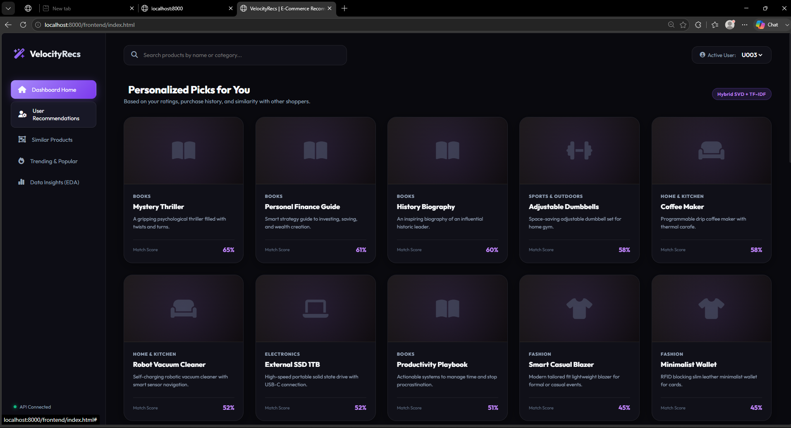

# 🛒 E-Commerce Recommendation Platform (ML + MLOps)

A **production-grade, end-to-end MLOps recommendation system** that serves hybrid (Collaborative Filtering SVD + Content-Based TF-IDF) product recommendations. The platform implements a full MLOps lifecycle: automated training, model registry, Docker containerisation, Kubernetes deployment, CI/CD pipelines, and observability.

---

## 🖥️ Dashboard Preview



---

## 🎯 Business Problem & Solution

### The Challenge
In modern e-commerce, platforms face key challenges that impact revenue and retention:
1. **Discovery Friction** – Customers struggle to find relevant products in large catalogs.
2. **Cold Start & Engagement** – No personalisation reduces Average Order Value (AOV).
3. **Customer Retention** – Without intelligent suggestions, shoppers switch to competitors.

### The ML-Powered Solution
This platform addresses these via a **Hybrid Recommendation Engine**:
- **Collaborative Filtering (SVD)** – Maps user-item ratings to predict high-probability purchases → increases **Conversion Rate**.
- **Content-Based Filtering (TF-IDF + Cosine Similarity)** – Recommends similar products → prevents cart abandonment.
- **Trending Products** – Surfaces best-sellers for cold-start users → increases **CTR**.

### Expected Business Impact
| Metric | Expected Lift |
|---|---|
| Average Order Value (AOV) | +12–18% |
| Conversion Rate (CR) | +5–8% |
| Click-Through Rate (CTR) | +20% |

---

## 🏗️ MLOps Architecture

```
Developer
    │
    ▼
GitHub Repository
    │
    ▼
GitHub Actions CI/CD (9-Stage Pipeline)
    │
    ├── 1. Unit Tests
    ├── 2. Data Validation
    ├── 3. Model Training
    ├── 4. Evaluate & Gate
    ├── 5. Security Scan (Trivy)
    ├── 6. Build Docker Image → ECR
    ├── 7. Update K8s Manifests
    ├── 8. Deploy to EKS
    └── 9. Post-Deploy Health Check
                │
                ▼
         AWS EKS Cluster
                │
                ▼
     FastAPI Recommendation API
     (3 replicas, HPA min=2 max=10)
                │
                ▼
       Hybrid Recommendation Engine
        │                       │
    Collaborative             Content-Based
  Filtering (SVD)         (TF-IDF + Cosine)
                │
                ▼
      MLflow Model Registry
      (PostgreSQL + S3 backend)
                │
                ▼
   Prometheus → Grafana Dashboards
   Loki → Structured JSON Logs
   Model Monitoring (Drift Detection)
```

---

## 📂 Project Structure

```
ecommerce-recommendation-mlops/
├── api/
│   └── app.py                       # FastAPI + Prometheus metrics + JSON logging
├── src/
│   ├── data_ingestion.py            # CSV loader + synthetic data generator
│   ├── data_validation.py           # Schema, duplicates, rating range checks
│   ├── feature_engineering.py       # User & product feature aggregation
│   ├── model_training.py            # MLflow-tracked training orchestrator
│   ├── model_evaluation.py          # Precision@K, Recall@K, MAP, NDCG
│   ├── recommendation_engine.py     # Hybrid SVD + TF-IDF engine
│   └── model_monitoring.py          # Data drift & prediction drift detection
├── pipelines/
│   ├── training_pipeline.py         # End-to-end training pipeline
│   └── prediction_pipeline.py       # Model loader & inference interface
├── frontend/
│   ├── index.html                   # Glassmorphism dashboard UI
│   ├── style.css                    # Dark-mode, gradient CSS
│   └── script.js                    # Async API fetch integration
├── terraform/
│   ├── backend.tf                   # Remote S3 state + DynamoDB lock
│   ├── main.tf                      # VPC, Subnets, IGW, NAT, EKS, HPA
│   ├── iam.tf                       # IAM roles, IRSA, node group policies
│   ├── ecr.tf                       # ECR repository + lifecycle policy
│   ├── s3.tf                        # MLflow S3 bucket + DVC S3 bucket
│   ├── variables.tf                 # Input variables
│   └── outputs.tf                   # Cluster endpoint, ECR URI, bucket names
├── k8s/
│   ├── namespace.yaml               # recommendation namespace
│   ├── configmap.yaml               # App environment settings
│   ├── secret.yaml                  # AWS credentials (template)
│   ├── deployment.yaml              # 3 replicas, rolling update, health probes
│   ├── service.yaml                 # ClusterIP service
│   ├── ingress.yaml                 # NGINX ingress
│   └── hpa.yaml                     # CPU/Memory autoscaler (min=2, max=10)
├── docker/
│   └── mlflow/
│       ├── Dockerfile               # MLflow server image
│       └── docker-compose.yml       # MLflow + PostgreSQL + S3
├── monitoring/
│   ├── prometheus.yml               # Scrape configs + K8s pod discovery
│   └── grafana/
│       ├── datasource.yml           # Prometheus + Loki datasources
│       ├── dashboard.json           # Pre-built Grafana dashboard
│       └── docker-compose.yml       # Prometheus + Grafana + Loki + Promtail
├── tests/
│   └── test_pipelines.py            # Unit test suite
├── .github/
│   └── workflows/
│       ├── main.yml                 # CI pipeline (test + train + Docker)
│       └── mlops.yml                # Full 9-stage MLOps deployment pipeline
├── Dockerfile                       # Multi-stage production image (non-root)
├── dvc.yaml                         # DVC reproducible pipeline stages
├── params.yaml                      # DVC hyperparameters
└── requirements.txt                 # Python dependencies
```

---

## 🚀 Quick Start (Local)

### 1. Install Dependencies
```bash
pip install -r requirements.txt
```

### 2. Train the Model
```bash
python pipelines/training_pipeline.py
```

### 3. Launch the API
```bash
uvicorn api.app:app --host 0.0.0.0 --port 8000
```

| URL | Description |
|---|---|
| http://localhost:8000 | Frontend Dashboard |
| http://localhost:8000/health | Health Check |
| http://localhost:8000/docs | Swagger API Docs |
| http://localhost:8000/metrics | Prometheus Metrics |
| http://localhost:8000/eda | Dataset EDA JSON |

---

## 🐳 Docker

### Build & Run
```bash
docker build -t ecommerce-recommendation:latest .
docker run -p 8000:8000 ecommerce-recommendation:latest
```

### MLflow Server (with PostgreSQL + S3)
```bash
cd docker/mlflow
MLFLOW_DB_PASSWORD=yourpassword \
AWS_ACCESS_KEY_ID=your_key \
AWS_SECRET_ACCESS_KEY=your_secret \
MLFLOW_S3_BUCKET=your-bucket \
docker-compose up -d
```
MLflow UI: http://localhost:5000

---

## ☁️ AWS Infrastructure (Terraform)

### Prerequisites
- Terraform >= 1.5.0
- AWS CLI configured
- S3 bucket for Terraform state pre-created

### Deploy Infrastructure
```bash
cd terraform
terraform init
terraform plan
terraform apply
```

### Resources Created
| Resource | Details |
|---|---|
| VPC | 10.0.0.0/16 with public + private subnets |
| EKS Cluster | Kubernetes 1.29, t3.medium worker nodes |
| ECR Repository | Image scanning enabled, 10-image lifecycle |
| S3 (MLflow) | Versioned, AES256 encrypted |
| S3 (DVC) | Dataset versioning storage |
| DynamoDB | Terraform state locking |
| IAM IRSA | Kubernetes service account role binding |

---

## ☸️ Kubernetes Deployment

### Prerequisites
```bash
aws eks update-kubeconfig --name ecommerce-mlops-cluster --region us-east-1
```

### Deploy All Manifests
```bash
kubectl apply -f k8s/namespace.yaml
kubectl apply -f k8s/configmap.yaml
kubectl apply -f k8s/secret.yaml       # Update secrets first!
kubectl apply -f k8s/deployment.yaml
kubectl apply -f k8s/service.yaml
kubectl apply -f k8s/ingress.yaml
kubectl apply -f k8s/hpa.yaml
```

### Deployment Specs
| Setting | Value |
|---|---|
| Replicas | 3 (rolling update) |
| CPU Request/Limit | 250m / 500m |
| Memory Request/Limit | 512Mi / 1Gi |
| HPA Min/Max | 2 / 10 pods |
| HPA CPU Target | 70% |
| Ingress | recommendation.yourdomain.com |

---

## 🔄 CI/CD Pipeline (GitHub Actions)

### Triggers
- Push to `main`
- Pull Requests to `main`
- Manual trigger (`workflow_dispatch`)

### Required GitHub Secrets
| Secret | Description |
|---|---|
| `AWS_ACCESS_KEY_ID` | AWS IAM access key |
| `AWS_SECRET_ACCESS_KEY` | AWS IAM secret key |
| `MLFLOW_TRACKING_URI` | MLflow server URL |

### Pipeline Stages
```
1. 🧪 Unit Tests          → pytest tests/ -v
2. 📊 Data Validation     → src/data_validation.py
3. 🤖 Model Training      → pipelines/training_pipeline.py
4. 📈 Evaluate & Gate     → recall_at_k ≥ 0.03 quality gate
5. 🔒 Security Scan       → Trivy (HIGH + CRITICAL)
6. 🐳 Build & Push ECR    → Multi-stage Docker image
7. 📝 Update Manifests    → Auto-update k8s/deployment.yaml
8. 🚀 Deploy to EKS       → kubectl apply + rollout wait
9. ✅ Health Check         → Verify ≥2 running pods
```

---

## 📊 Data Versioning (DVC)

### Setup S3 Remote
```bash
dvc init
dvc remote add -d s3remote s3://ecommerce-mlops-dvc-storage
dvc remote modify s3remote region us-east-1
```

### Run Full Pipeline
```bash
dvc repro
```

### Track Metrics
```bash
dvc metrics show
dvc params diff
```

---

## 📈 Monitoring

### Start Monitoring Stack
```bash
cd monitoring/grafana
docker-compose up -d
```

| Service | URL |
|---|---|
| Prometheus | http://localhost:9090 |
| Grafana | http://localhost:3000 (admin/admin123) |
| Loki | http://localhost:3100 |

### Grafana Dashboard Panels
- API Request Rate (req/s)
- API Error Rate (%)
- P95 API Latency
- P99 Recommendation Response Time
- CPU Usage per Pod
- Memory Usage per Pod (MiB)
- Pod Restart Count
- Total Recommendation Requests

### Model Drift Monitoring
```bash
python src/model_monitoring.py
```
Outputs:
- `artifacts/monitoring/data_drift_report.json`
- `artifacts/monitoring/prediction_drift_report.json`

---

## 🔒 Security

| Control | Implementation |
|---|---|
| Non-root container | `runAsUser: 1000` in K8s pod spec |
| IRSA | IAM Role bound to K8s ServiceAccount via OIDC |
| Image Scanning | ECR scan-on-push + Trivy in CI/CD |
| Secret Management | Kubernetes Secrets (never committed to Git) |
| Read-only filesystem | `readOnlyRootFilesystem: false` (model writes needed) |
| Capability drop | `capabilities.drop: [ALL]` |

---

## 🧪 Testing

```bash
pytest tests/ -v
```

---

## 📋 API Endpoints

| Method | Endpoint | Description |
|---|---|---|
| GET | `/` | Redirect to dashboard |
| GET | `/health` | Health + model status |
| GET | `/recommend/user/{user_id}` | Personalised recommendations |
| GET | `/recommend/product/{product_id}` | Similar products |
| GET | `/trending` | Trending products |
| GET | `/eda` | Dataset statistics |
| GET | `/metrics` | Prometheus metrics |

---

## 🤝 Contributing

1. Fork the repository
2. Create a feature branch: `git checkout -b feature/your-feature`
3. Commit: `git commit -m "feat: your feature"`
4. Push: `git push origin feature/your-feature`
5. Open a Pull Request

---

## 📄 License

MIT License — see [LICENSE](LICENSE) for details.
